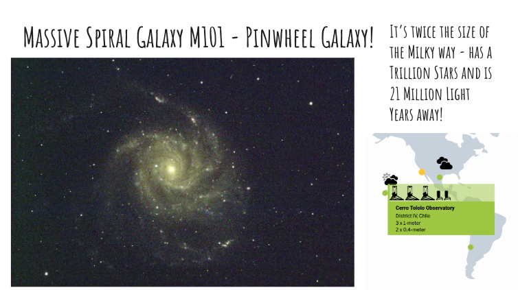

## Astro Imaging using Global Telescopes

Students will learn to image astronomical targets such as Stars, Galaxies and Nebulae, Star Clusters etc. using the global telescopes of Las Cumbres Observatory in the Southern hemisphere as well as San Diego in the USA.

### [Click here for details!](https://docs.google.com/presentation/d/1L8q5FArEkUWsPNfDLy3HekTYAK-xyk0GFg3iHbKeEBk/edit?slide=id.g142ebf5fc21_1_4#slide=id.g142ebf5fc21_1_4)