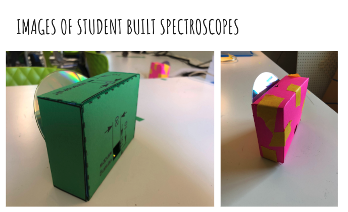

## Build a Spectroscope to study the nature of Light

Students will learn about the nature of Light. They will build a Paper Spectroscope with an discarded compact disk (CD) and look at sunlight, flourescent lamps, LED lamps, incandescent lamps. They wil learn about the conceot of color, wavelength and frequency.

### [Click here for details!](https://docs.google.com/presentation/d/1L8q5FArEkUWsPNfDLy3HekTYAK-xyk0GFg3iHbKeEBk/edit?slide=id.g143bfccabfa_0_3#slide=id.g143bfccabfa_0_3)

