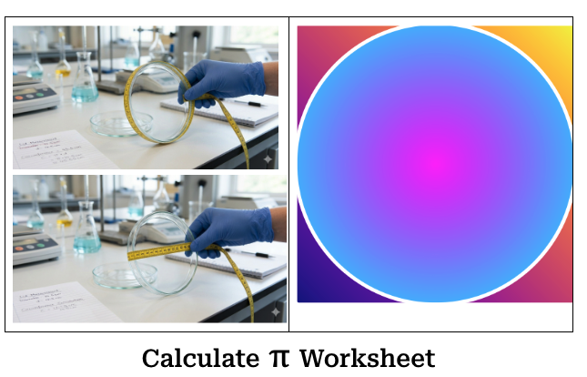

## Calculate PI

Students will enhance their knowledge about Rations, Fractions.  They will learn about and calculate the value of PI.

### [Ratios, Fractions, Cross-multiplications](https://docs.google.com/document/d/1qPb-s2bMtGL6yc2ziV_uqj609CENljCmQe5pdh1RHvA/edit?tab=t.0)

### [Calculate PI Lab](https://docs.google.com/document/d/1jWOBEf-mJuVTAEecn2nfoc0TmbRO6QaWwwWQcBJ1MSI/edit?tab=t.0)
