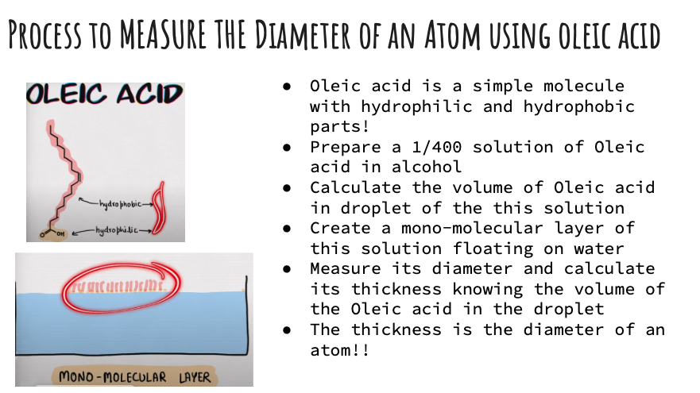

## Calculate Diameter of an Atom

Students will learn about sizes very small things like atoms. They will measure it in a lab using the Oleic acid molecule. They will learn about powers of 10.

### [Measure the size of a single Atom](https://boyceastrows.gleeze.com/hub/login)

