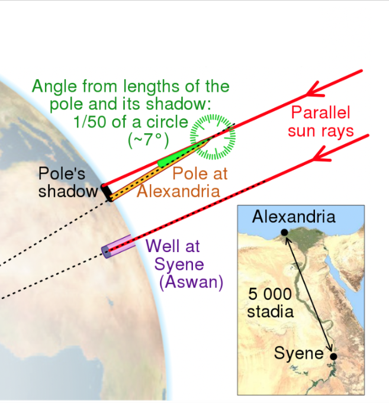

## Calculate Diameter of the Earth

Students will learn about sizes very big things like the Earth. They will measure using similar triangles following the process by Eratosthenes. 

### [Measure the diameter of the Earth in a Jupyter Notebook](https://boyceastrows.gleeze.com/hub/user-redirect/git-pull?repo=https://github.com/drunarayan/fibonacci&branch=gh-pages&urlpath=lab/tree/fibonacci/notebooks/dia_of_earth/eratosthenes_earth_circum.ipynb?reset)

