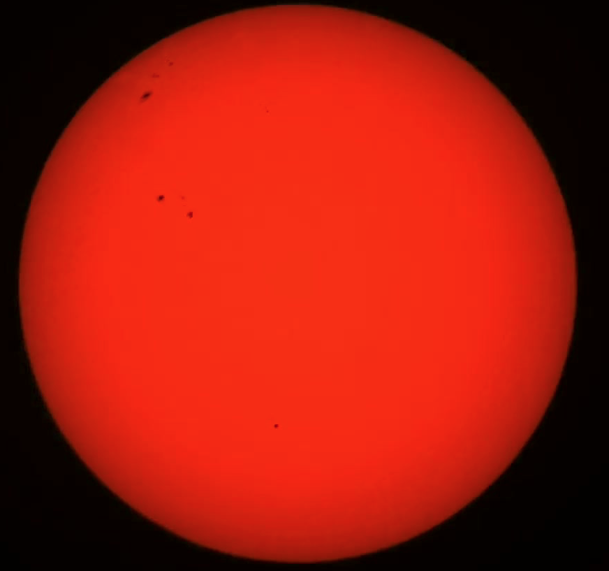

## Calculate the Diameter of the Sun

Students will learn about sizes stupendously big things like the Sun. They will measure the Sun by imaging it via the Seestar Telescope. 

### 1. Capture at least a single transit of the Sun across it's own diameter using the SeeStar S50 Telescope - completed May 29, 2026

### 2. [Download the Sun Transit Video here](https://drive.google.com/file/d/10PpUn1g-Pnz15PcW9VuB7nASutPqNzhv/view?usp=sharing)

### 3. [Measure the diameter of the Sun in a Jupyter Notebook](https://boyceastrows.gleeze.com/hub/user-redirect/git-pull?repo=https://github.com/drunarayan/fibonacci&branch=gh-pages&urlpath=lab/tree/fibonacci/notebooks/dia_of_sun/sun_dia_and_dist.ipynb?reset)

