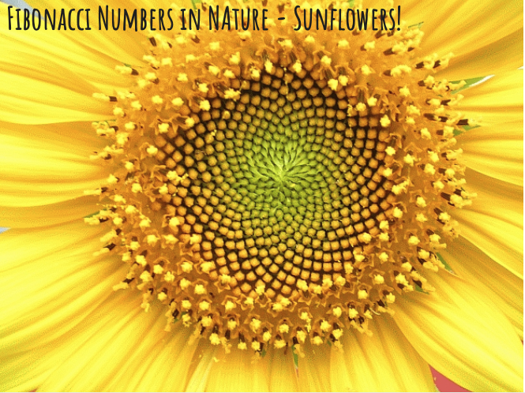

## Fibonacci Numbers, Normal Distributions & Galton Board

Students will learn about the statistical nature of our world. They will learn about averages, errors and naturally ocurring distributions in nature such as the Normal Distribution.  They will learn the Pascal's Triangle and Fibonacci Numbers and how nature follows these patterns.

### [Fibonacci & Pascal's Triangle](https://docs.google.com/presentation/d/1L8q5FArEkUWsPNfDLy3HekTYAK-xyk0GFg3iHbKeEBk/edit?slide=id.g147bfce383c_10_54#slide=id.g147bfce383c_10_54)

### [Galton Board](https://docs.google.com/presentation/d/1L8q5FArEkUWsPNfDLy3HekTYAK-xyk0GFg3iHbKeEBk/edit?slide=id.g1428a4bd0be_2_0#slide=id.g1428a4bd0be_2_0)

