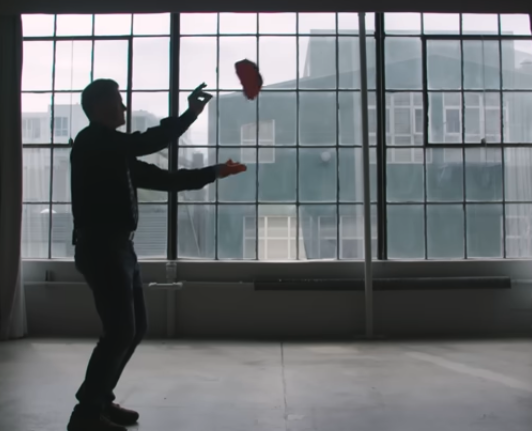

## Origami Fold Paper Airplanes and learn to Fly them

Students will Origami Fold many kinds of Paper Airplanes and Fly to learn a bit of Aerodynamics. Which airplane can go the farthest? Which airplane  can go the longest? Which airplane  can boomerang back?

### [Record Flyer](https://youtu.be/JhYZy1ugI3Q?si=PUlSFG7iYuccCSdg&t=1062)

### [Tumbler](https://youtu.be/JhYZy1ugI3Q?si=zphRtMZuIP-9RxL-&t=934)

### [Boomerang](https://youtu.be/JhYZy1ugI3Q?si=zj3wJkVrpJxcUi1E&t=300)

